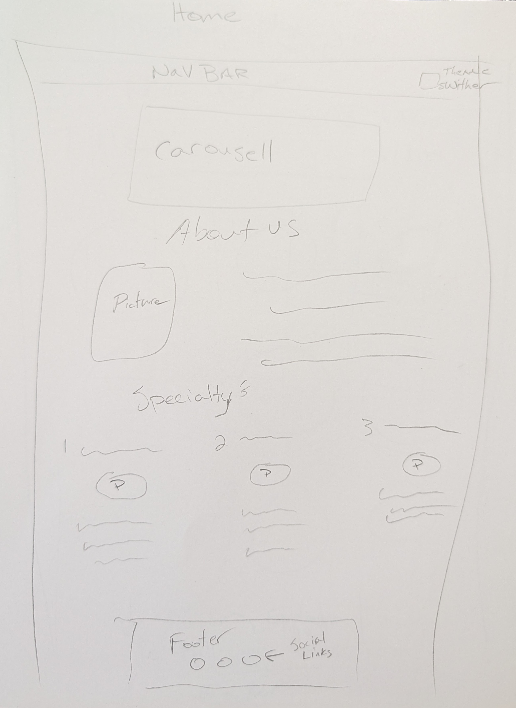
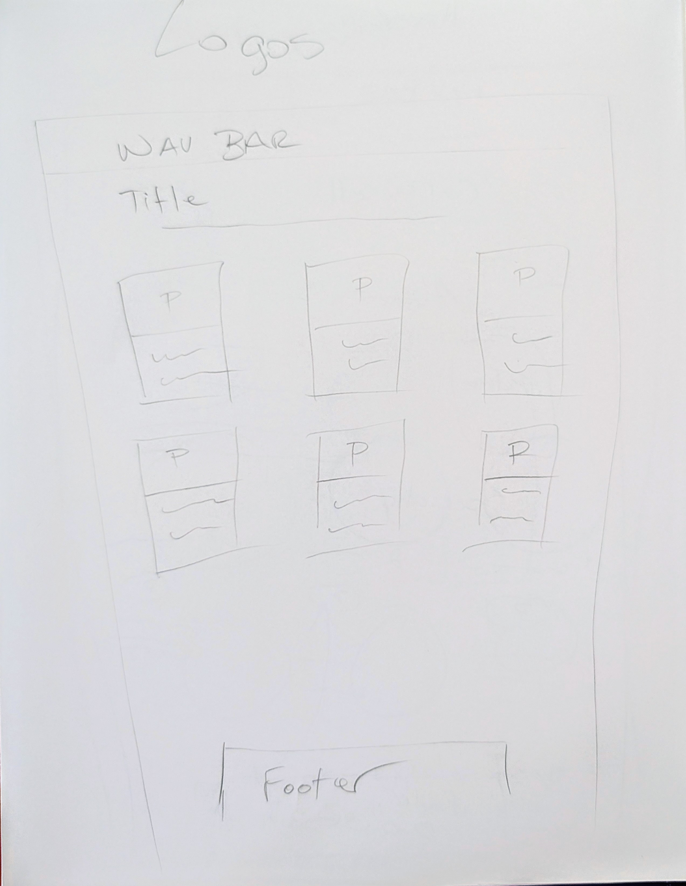
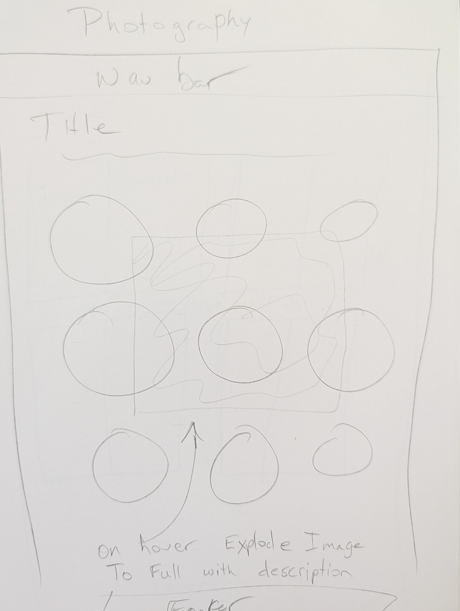
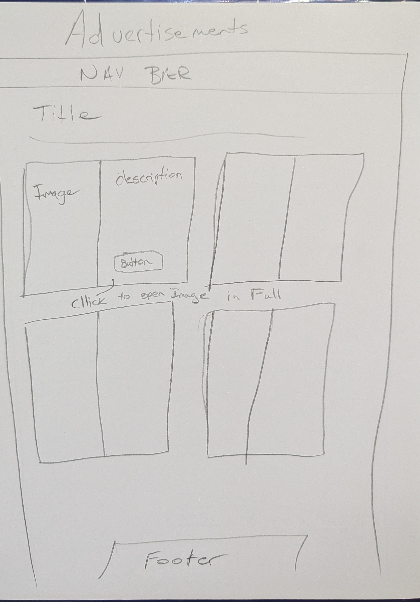
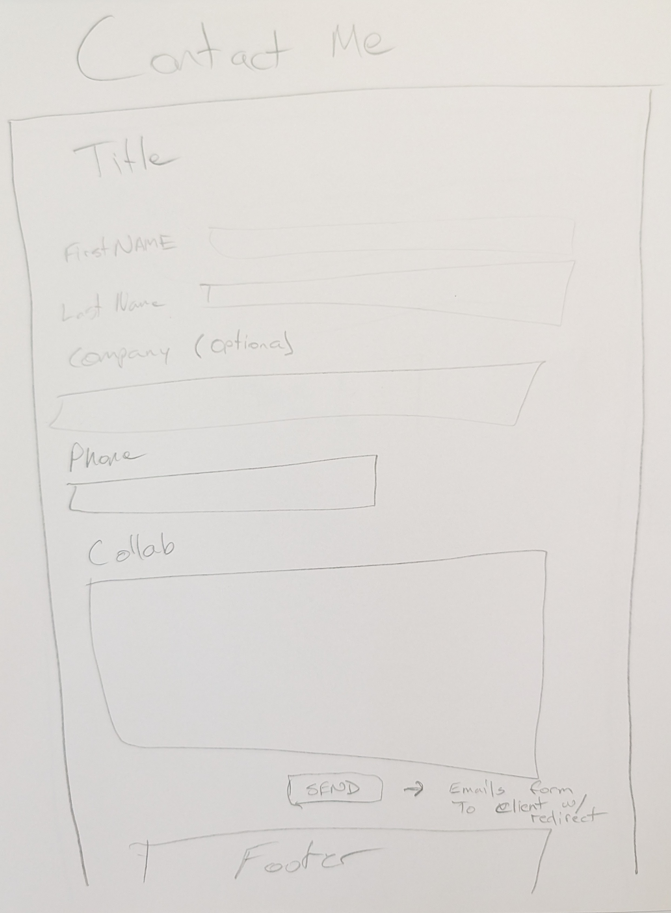
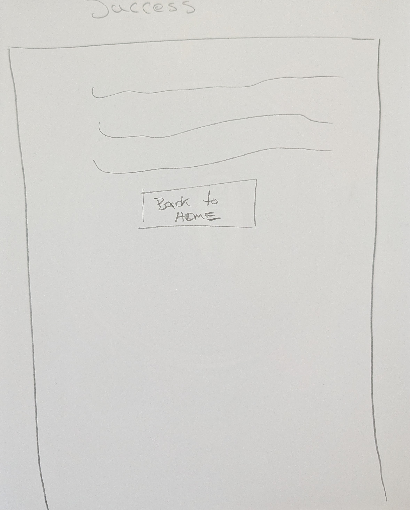

# Portfolio
This website is being used as a portfolio to showcase the abilities and scope of talent brought by Rose Digital Imaging

## Developer
Benjamin Rose

## Technology Used
1. Html
2. CSS
3. Java
4. Bootstrap

## User Stories
1. I want this website to be responsive across different screen sizes with a theme switcher. The navigation should also be easy to follow and simple to navigate.
2. There should be a page for logos, a page for photography, and a page for advertisements. Each should showcase the work in a different format; for example, the advertisement page should include an image to view the advertisement in full format.
3. I want the contact page to include a simple form for people to fill out in the advent that they would like some work done. make it a little informal yet require phone number, name, and email. Also make it so it sends me an email of the form upon completion. Then redirect the user to a success page and a button returning them to the home page.

## WireFrame

